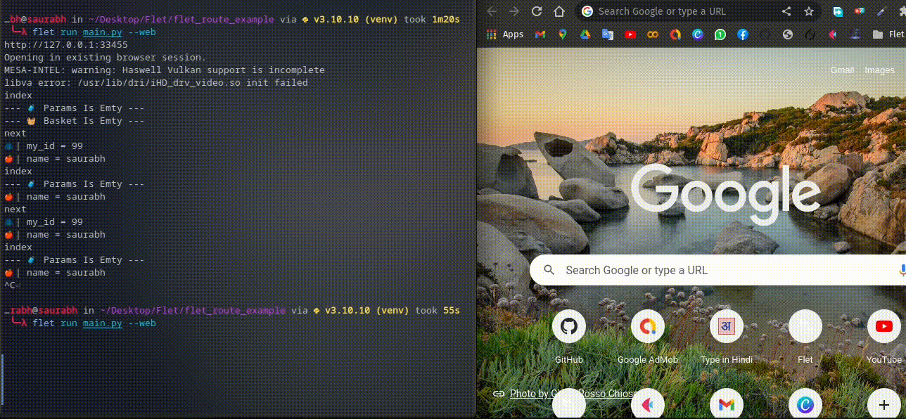

# Function Based View
### Directory Structure 


### main.py
```python
import flet as ft
from flet_route import Routing,path
from views.index_view import IndexView # Here IndexView is imported from views/index_view.py
from views.next_view import NextView # Here NextView is imported from views/next_view.py

def main(page: ft.Page):

    app_routes = [
        path(
            url="/", # Here you have to give that url which will call your view on mach
            clear=True, # If you want to clear all the routes you have passed so far, then pass True otherwise False.
            view=IndexView # Here you have to pass a function or method which will take page,params and basket and return ft.View (If you are using function based view then you just have to give the name of the function.)
            ), 
        path(url="/next_view/:my_id", clear=False, view=NextView),
    ]

    Routing(
        page=page, # Here you have to pass the page. Which will be found as a parameter in all your views
        app_routes=app_routes, # Here a list has to be passed in which we have defined app routing like app_routes
        )
    page.go(page.route)

ft.app(target=main)


```

### views/index_view.py

This is a basic python function that takes `page`,`params` and `basket` and returns `ft.View`.

In `page` we get the `page` passed in `Routing`.

In `params` we get the object of `Params` class.
In which all the `values` ​​extracted from the URL are in the form of variables.

```python
import flet as ft
from flet_route import Params,Basket

def IndexView(page:ft.Page,params:Params,basket:Basket):
    print(params)
    print(basket)
    return ft.View(
        "/",
        controls=[
            ft.Text("This Is Index View"),
            ft.ElevatedButton("Go Next View", on_click=lambda _: page.go("/next_view/10")),
        ]
    )

```

### views/next_view.py

```python
import flet as ft
from flet_route import Params,Basket

def NextView(page:ft.Page,params:Params,basket:Basket):
    print(params)
    print(basket)
    return ft.View(
        "/next_view/:my_id",
        controls=[
            ft.Text("This Is Next View"),
            ft.ElevatedButton("Go Index View", on_click=lambda _: page.go("/")),
        ]
    )

```

### GIF

