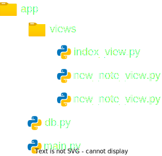
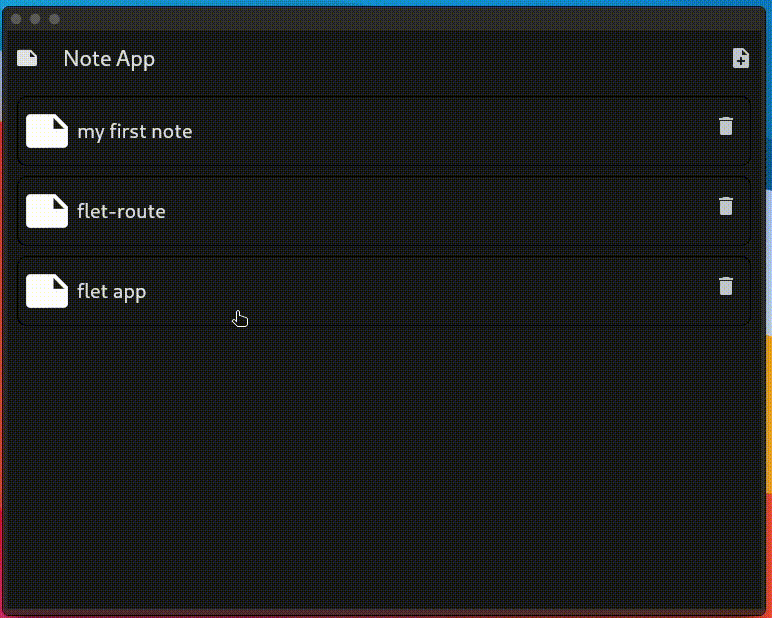

# Note App
### Directory Structure 




### main.py
```python
import flet as ft
from flet_route import Routing,path
from views.index_view import IndexView
from views.new_note_view import NewNoteView
from views.old_note_view import OldNoteView
from db import create_tables

create_tables()

def main(page: ft.Page):

    app_routes = [
        path(url="/", clear=True, view=IndexView),
        path(url="/new_note/", clear=False, view=NewNoteView),
        path(url="/old_note/:id", clear=False, view=OldNoteView),
    ]

    Routing(page=page,app_routes=app_routes)
    page.go(page.route)

ft.app(target=main)

```


### db.py
```python
from sqlmodel import (
    SQLModel,
    create_engine,
    Session,
    Field,
    select,
)
from typing import Optional


database_file_name = "database.sqlite3"
engine = create_engine(f"sqlite:///{database_file_name}")


class Notes(SQLModel,table=True):
    id : Optional[int] = Field(primary_key=True,default=None,nullable=False)
    title : str = Field(nullable=False)
    note : str = Field(nullable=False)

    def add(self,title,note):
        new_note = Notes(title=title,note=note)
        with Session(engine) as session:
            session.add(new_note)
            session.commit()
            return True
        
    def update(self,id,title,note):
        with Session(engine) as session:
            statement = select(Notes).where(Notes.id == id)
            results = session.exec(statement)
            old_note = results.one()
            old_note.title = title
            old_note.note = note
            session.add(old_note)
            session.commit()
            return True
    
    def get_all(self):
        with Session(engine) as session:
            statement = select(Notes)
            results = session.exec(statement)
            return results.all()
        
    def get_by_id(self,id):
        with Session(engine) as session:
            statement = select(Notes).where(Notes.id == id)
            results = session.exec(statement)
            return results.first()

    def delete(self,id):
        with Session(engine) as session:
            statement = select(Notes).where(Notes.id == id)
            results = session.exec(statement).first()
            session.delete(results)
            session.commit()
            return True


def create_tables():
    SQLModel.metadata.create_all(engine)


```

### views/index_view.py

```python
import flet as ft
from flet_route import Params, Basket
from db import Notes


def IndexView(page: ft.Page, params: Params, basket: Basket):

    if basket.get("notes") == None:
        basket.notes = Notes()

    def delete_note(id):
        basket.notes.delete(id = id)
        get_all_notes()
        page.update()

    row = []
    def get_all_notes():
        row.clear()
        for i in basket.notes.get_all():
            row.append(
                ft.Stack(
                    [
                        ft.Container(
                            height=70,
                            border_radius=10,
                            border=ft.Border(
                                top=ft.BorderSide(width=1),
                                bottom=ft.BorderSide(width=1),
                                left=ft.BorderSide(width=1),
                                right=ft.BorderSide(width=1)
                            )
                        ),
                        ft.Container(
                            content=ft.Icon(ft.icons.NOTE, size=50),
                            top=10,
                            left=5
                        ),
                        ft.Text(
                            max_lines=1,
                            overflow=ft.TextOverflow.CLIP,
                            top=20,
                            left=60,
                            value=i.title,
                            size=20
                        ),
                        ft.Container(
                            height=70,
                            border_radius=10,
                            on_click=lambda e,id=i.id: page.go(f"/old_note/{id}")
                        ),
                        ft.IconButton(
                            icon=ft.icons.DELETE,
                            right=5,
                            top=10,
                            on_click= lambda e,id=i.id: delete_note(id)
                        ),

                    ]
                )
            )

    get_all_notes()

    return ft.View(
        "/",
        controls=[
            ft.AppBar(
                leading=ft.Icon(ft.icons.NOTE),
                leading_width=40,
                title=ft.Text("Note App"),
                center_title=False,
                actions=[
                    ft.IconButton(
                        ft.icons.NOTE_ADD,
                        on_click=lambda e: page.go("/new_note/")
                    ),
                ],
            ),
            ft.Column(row)

        ],
        scroll="auto"
    )


```

### views/new_note_view.py

```python
import flet as ft
from flet_route import Params, Basket


def NewNoteView(page: ft.Page, params: Params, basket: Basket):


    ref_title = ft.Ref[ft.TextField]()
    ref_text = ft.Ref[ft.TextField]()

    def save_note(e):
        basket.notes.add(
            title = ref_title.current.value,
            note = ref_text.current.value,
        )
        page.go("/")

    return ft.View(
        "/new_note/",
        controls=[
            ft.AppBar(
                title=ft.Text("New Note"),
                actions=[
                    ft.IconButton(
                        ft.icons.SAVE,
                        on_click= save_note
                    ),
                ],),
            ft.TextField(
                ref=ref_title,
                label="Title",
            ),
            ft.TextField(
                ref=ref_text,
                expand=True,
                multiline=True,
                value="\n\n\n\n\n\n\n\n\n\n\n\n\n\n\n\n\n\n\n\n\n\n\n\n\n\n\n\n\n\n\n\n\n\n\n\n\n\n\n\n\n\n\n\n\n\n\n\n",

            ),

        ],
        scroll="auto"
    )

```


### views/old_note_view.py

```python
import flet as ft
from flet_route import Params, Basket


def NewNoteView(page: ft.Page, params: Params, basket: Basket):


    ref_title = ft.Ref[ft.TextField]()
    ref_text = ft.Ref[ft.TextField]()

    def save_note(e):
        basket.notes.add(
            title = ref_title.current.value,
            note = ref_text.current.value,
        )
        page.go("/")

    return ft.View(
        "/new_note/",
        controls=[
            ft.AppBar(
                title=ft.Text("New Note"),
                actions=[
                    ft.IconButton(
                        ft.icons.SAVE,
                        on_click= save_note
                    ),
                ],),
            ft.TextField(
                ref=ref_title,
                label="Title",
            ),
            ft.TextField(
                ref=ref_text,
                expand=True,
                multiline=True,
                value="\n\n\n\n\n\n\n\n\n\n\n\n\n\n\n\n\n\n\n\n\n\n\n\n\n\n\n\n\n\n\n\n\n\n\n\n\n\n\n\n\n\n\n\n\n\n\n\n",

            ),

        ],
        scroll="auto"
    )

```

### GIF

